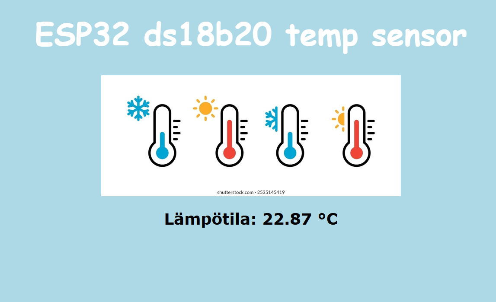
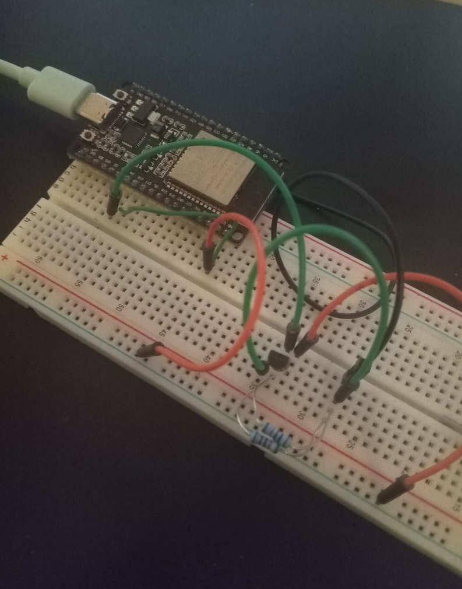

# ESP32 simple http and temp sensor

This esp32 project is a simple web server, that uses wifi and DS18B20-temperature sensor.
### The following libraries can be downloaded from arduino IDE library
- #include <WiFi.h>
- #include <DS18B20.h>

You can rename your SSID credentials accordingly in the arduino sketch: ESP32-http-temp.ino 

The esp32 connects to wifi and shares it's local ip address through serial port.

You can view the http with browser and typing the board's ip address.

### Python html converter script

Includes python script that converts html inside the  client.println() functions,
- Make pasting your own site faster!

Sketch uses DS18B20 on GPIO4-pin, but that can be changed in the sketch code.

Connections picture above and info how to connect the sensor is from this site:
<a href="https://randomnerdtutorials.com/esp32-ds18b20-temperature-arduino-ide/">https://randomnerdtutorials.com/esp32-ds18b20-temperature-arduino-ide/</href>
